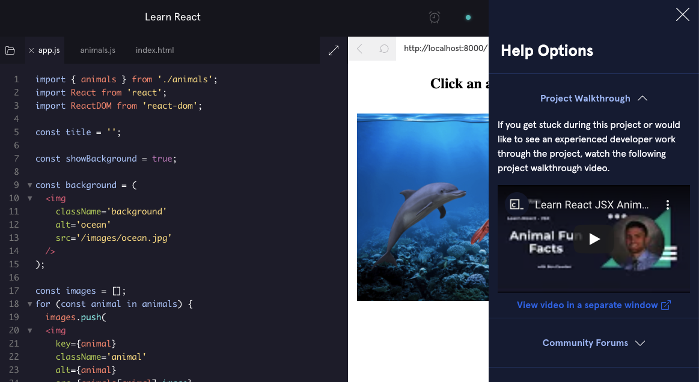
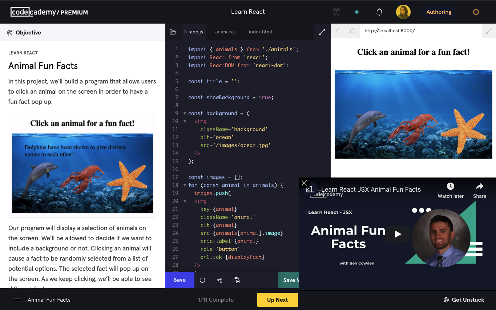

# Project Walkthrough Video Guidelines

Project walkthrough videos are a way of helping learners progress through a project. We don't validate learners code for projects because they are meant to have a lower level of hand-holding. Project walkthrough videos can be linked in Author and show up when learners click on "Get Unstuck" button on the bottom right corner of the learning environment.

Learners can also click on the "View ideo in a separate window" button to see the video on to bottom right side like below. Because learners will tend to watch the project walkthrough video as they work on the project themselves, it's important that your video walks through each task of the project and mark them off (check the box next to the task) as you complete each task. You should also explain how you derived your code from the task instruction text. Also remember to run your code if the task instructs you to do so, or if you think it is necessary.

## Style Guide

Check out this [Project Walkthrough Video Style Guide](https://docs.google.com/document/d/1XH0Z3DxWzP6EOMm8tKqBI5H3oj1Hj8jhIQQe-Xhi09g/edit?usp=sharing).

This document explains some guidelines that you should follow when you make a project walkthrough video. It also explains the workflow for pre-production, production and post-production phase.

## Video Slide Deck

Check out [these templates](https://docs.google.com/presentation/d/1QMbmjEI4S-1bR9ohyxkFYsmU5KYbdxZDEz7OpWE01Zs/edit?usp=sharing) for video slide decks. 

The slide decks are templates that you can chose from to use for your project walkthrough video. Make a duplicate of the slide deck, or download them to edit for your project. 

## Example Videos

* [Learn Python: Thread Shed](https://www.youtube.com/watch?v=x1AxPYJwHCw)

* [Learn C#: Supernatural Inheritance](https://www.youtube.com/watch?v=vQknhZBG4rU)

## Workflow

Please upload your drafts in the [Production Pre-Author Drafts](https://drive.google.com/drive/u/0/folders/1mSFh3MXdzaQ8txVUZszyabgDhhKI43Y7) folder and set the status of the relevant Jira ticket "Ready for Review".