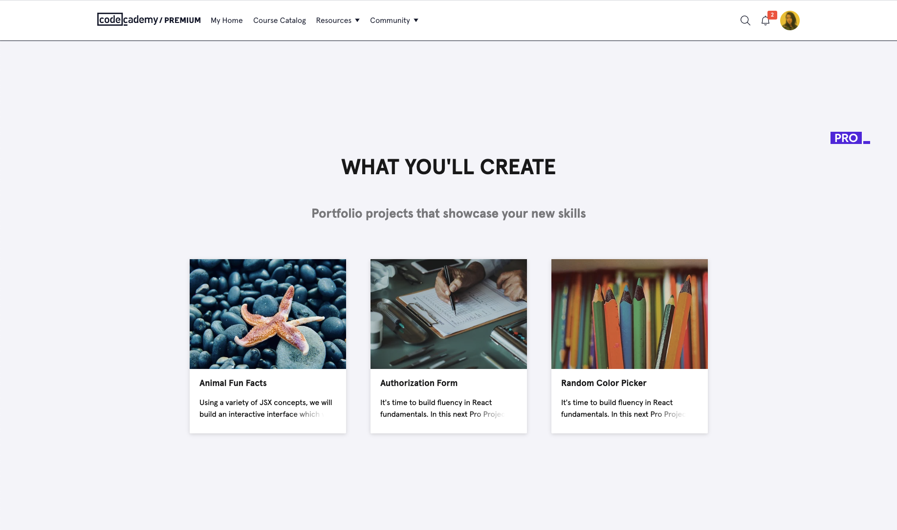

# Project Instructions

_Read the [content standards](http://curriculum-documentation.codecademy.com/Content-Standards/project/) for expectations on writing project instructions._

Important points from the content standards:

* An on-platform project is an opportunity for the learner to take the material they've learned in a previous lesson and apply it within the guided practice framework of a project.
* A project is made of up a series of tasks, which can be grouped in sections, that should all build towards a final product or solution.

Examples of project drafts:

* [Learn React: Lifecycle Methods](https://docs.google.com/document/d/1HUpDbO61BS_a70ZrjC-sO0b3jYVb-TZHkE4EVyXCRL0/edit)
* [Learn React: Hooks](https://docs.google.com/document/d/1ESQH_DWFJhtYjwoDG6cOY-8IiPcWR8wEclSzJq-rxx4/edit)

Examples of projects in Author:

* [Learn Phaser: Animations](https://author.codecademy.com/content-items/794d038ca4613b8e3ffa3a0516ac674e)
  * [Preview](https://www.codecademy.com/content-items/794d038ca4613b8e3ffa3a0516ac674e?preview=true)
* [Learn React: Hooks](https://author.codecademy.com/content-items/ed4b3ab6fcc8813b780acba750446e55)
  * [Preview](https://www.codecademy.com/content-items/ed4b3ab6fcc8813b780acba750446e55?preview=true)

## Project Information

### Resource(s)

_Insert any resources you used while researching to help plan your project._

1. Resource

### Description

* This should be a 1- or 2-sentence description about what the learners will do for this project. The description text shows up like above in the course syllabus along with the thumbnail image.
* Examples:
  * "Create a game that includes scene transitions, animations, and tweens!"
  * "Using a variety of JSX concepts, we will build an interactive interface which will display a selection of animal images and allow you to click an image for a fun fact."
  * "Let’s use React Hooks to build a place for your wandering thoughts."

### Objective

* The objective text appears in the narrative before learners click the "Start" button to begin working on the project. It should describe what they are going to do for the project and what they are building. Think of it as an introduction text about the project.

### Thumbnail Image URL

_Select a stock photo from a website like [pexels.com](https://www.pexels.com/) or [unsplash.com](https://unsplash.com/). Resize the image to a width of 500px or less, using your own software or an online service like [resizeimage.net](https://resizeimage.net/)._

* Find a stock image relavant to the project and leave the link here. I'll download, resize, and format the image and upload to our s3 server and replace the link.

## Task Group #1: _Insert Title_

* It will help to figure out the order of high-level tasks for this project and break it down into individual task items.

### Task #1

* Each task should only ask for one step. For example, "Write a function that returns the sum of two numbers. Then, write a function that returns the product of two input numbers." should be broken up into two separate tasks.
* Try to explain why the step is necessary / how it relates to the project as a whole.
* You don't have to write tests to check if learner code is correct for projects. This also means that the instructions should be fairly straight forward, but there is less hand-holding compare to how checkpoint instructions in lessons are written.
* Provide a way for learners to self-evaluate their work (where you can). For example, you can write in your task text what they should be seeing in the sketch after they've completed the task. 
* The last task can include optional/suggested next steps.

### Hint

* Ideally there should be a hint for each task.

### Task #2

### Hint

### Task #3

### Hint

## Task Group #2: _Insert Title_

### Task #4

### Hint

### Task #5

### Hint

### Task #6

### Hint