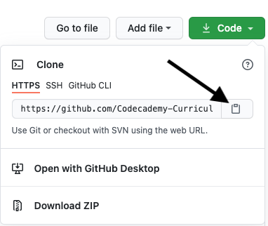
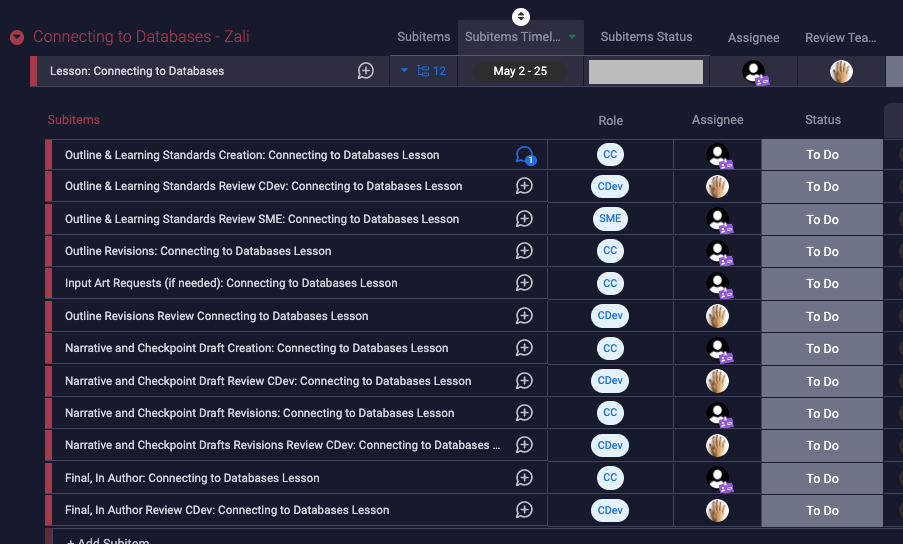
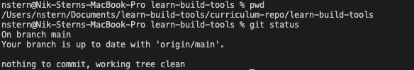
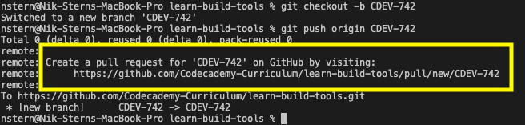
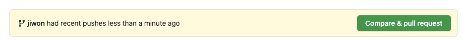
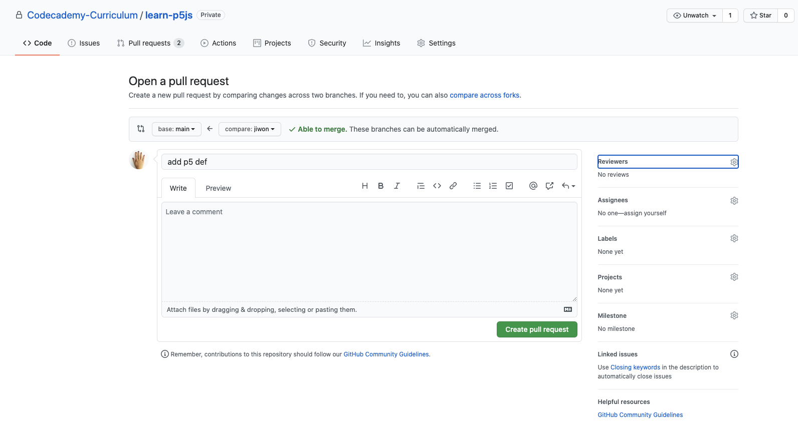
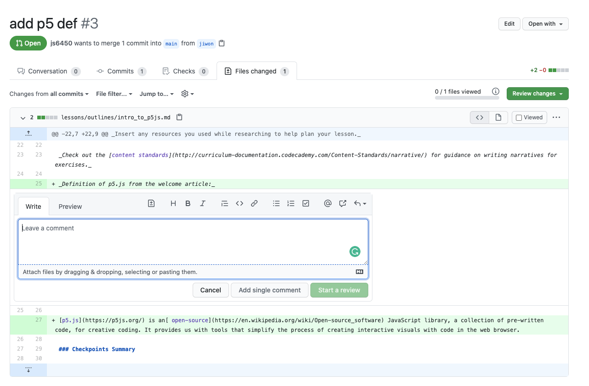

[Syllabus]: https://skillsoft.sharepoint.com/:x:/r/sites/IntTeamDrive/Shared%20Documents/Curriculum/2.%20Curriculum%20Development/Domains/Web%20Development/Courses%20and%20Skill%20Paths/Learn%20Next.js/%5BLearn%20Next.js%5D%20Syllabus.xlsx?d=wa91aec77de4846c78b5f1f0b5c0712f4&csf=1&web=1&e=JPf0M9
[Github Repo]: https://github.com/Codecademy-Curriculum/learn-nextjs
[Monday.com Board]: https://codecademy-unit.monday.com/boards/5420359317

# Git For Draft Production

Git and Github is becoming a popular option for curriculum draft production. In addition to its collaboration and version history features, Github is desirable due to its ability to render Markdown, unlike Google Docs.

## Table of Contents

- [Learning to Use Git](#learning-to-use-git)
- [Important Tools](#important-tools)
- [Setting Up Your Workspace](#setting-up-your-workspace)
- [Find Your Next Task](#find-your-next-task)
- [Prepare Your Environment For Work](#prepare-your-environment-for-work)
  - [Check That You Are In The Right Place](#check-that-you-are-in-the-right-place)
  - [Ensure You are Starting From Main](#ensure-you-are-starting-from-main)
  - [Make Sure Your Local Repo Is Up To Date](#make-sure-your-local-repo-is-up-to-date)
  - [Create A Branch For Your Ticket](#create-a-branch-for-your-ticket)
- [Work On Your Assigned Content](#work-on-your-assigned-content)
- [Saving Local Versions of Your Work](#saving-local-versions-of-your-work)
- [Save A Version Online](#save-a-version-online)
- [My Work is Blocked](#my-work-is-blocked)
- [Submit a Finished Draft](#submit-a-finished-draft)
  - [Option 1: Link in the terminal](#option-1-link-in-the-terminal)
  - [Option 2: Using the Browser](#option-2-using-the-browser)
  - [Filling Out the Pull Request](#filling-out-the-pull-request)
  - [Linking the Pull Request to Jira](#linking-the-pull-request-to-jira)
- [When Your Work is Being Reviewed](#when-your-work-is-being-reviewed)
  - [How Do I Know My Draft Needs More Work?](#how-do-i-know-my-draft-needs-more-work)
- [Incorperating Feedback](#incorperating-feedback)
  - [Incorperate Any Reviewer Commits](#incorperate-any-reviewer-commits)
  - [Consider The Reviewer Comments:](#consider-the-reviewer-comments)
  - [Resubmit Your Draft](#resubmit-your-draft)
- [Your Draft Was Accepted](#your-draft-was-accepted)

## Learning to Use Git

If you are unfamiliar with using Git via the command line, it is recommended that you go through Codecademy's [Git course](https://www.codecademy.com/learn/learn-git).

## Important Tools

* Each content contributor's production schedule can be found in the [Monday.com board]. Refer to this board for deadlines.
* The [Github Repo] is where all new and updated content lives. Drafts are submitted here as pull requests by content contributors and merged into main branch by a CDev. 
* All feedback lives in [GitHub Repo] as comments (either in PR, or as in-line comments).
* Be sure to update your progress on tickets in the [Monday.com Board].


## Setting Up Your Workspace

Navigate to the directory where you want to store the repository folder. For example:

```
cd Documents
```

Go to the [Github Repo], and copy the HTTPS link



Clone the repo with the following command in the terminal:

```
git clone <LINK>
```

If prompted to authenticate, you can generate a [personal access token](https://docs.github.com/en/authentication/keeping-your-account-and-data-secure/managing-your-personal-access-tokens#about-personal-access-tokens).

At this point the most recent "main" version of the course should be on your computer. Feel free to open it in an IDE such as Visual Studio Code and explore the existing files.

## Find Your Next Task

Go to the [Monday.com board] and locate the task with your name.



Each task will have a list of subitems, in the order that needs to be completed. Each subitem should have a description, and a link to the file you will need to complete your work in.

## Prepare Your Environment For Work

### Check That You Are In The Right Place

Ensure your terminal's working directory is your local course repo by using `pwd` and `git status`.

`pwd` should print the name of the folder for the repository, and `git status` should display git information for your local repository.



### Ensure You are Starting From Main

Hopping from one development branch to another will introduce more and more changes, and add unrelated items to your pull requests. To prevent merge conflicts and unintended changes, we want each pull request to be as narrow in scope as possible.

Before beginning work, check out the main branch with `git checkout -b main` in order to begin work off of the team's currently accepted version of the project.

### Make Sure Your Local Repo Is Up To Date

Fetch the latest changes from the remote repository by running:

```
git pull origin main
```

### Create A Branch For Your Ticket

Create and switch to a branch named after your task by using the `git checkout -b <branch-name>` command. For example, if you are working on a lesson outline, you can name your branch `<lesson-name>-outline`.

To checkout a new branch, run the command:

```
git checkout -b <name-of-branch>
```

Ensure you are on the correct branch by running the `git branch` command.

The highlighted branch with the asterisk should match the ticket you want to work on.

## Work On Your Assigned Content

When you begin work on a ticket, ensure that its status is "In Progress" on the [Monday.com Board]. 

Write content using the tool of your choice, as long as it is able to save changes to the local git repository directory.

## Saving Local Versions of Your Work

Git provides us with the ability to switch between many different saved versions of our work. These versions can be saved on your local computer, as well as uploaded to the remote repository.

You might want to save local versions within the same work sessions, while you'd definitely want to save remote versions if you were going to switch computers, or want someone else to see your work.

To save a local version, start by running `git status`. This will provide you with an overview of the changes you have made since your list commit. This will include a list of files that you have created, deleted, or modified.

Use `git add` followed by a list of the files whose changes you want to store in this commit. You can also do `git add .` to quickly add all the changes, but this may introduce files you don't want to be stored in the commit.

Once you have added the necessary file changes, use `git commit -m "<message>"` to save this version of your project, along with a message describing the important differences between this version and the last.

## Save A Version Online

To save a version of your work onto the remote repository, follow the steps to save it locally (unless you've just done so), and then push the changes to the remote with the command:

```
git push origin <YOUR BRANCH NAME>
```

If prompted to set an upstream branch, use the following command:

```
git push --set-upstream origin <YOUR BRANCH NAME>
```

Remember, your branch name is the identifier of the Jira ticket.

## My Work is Blocked

As you work on a draft, you may encounter a problem making you unable to continue or require feedback from a CDev on an unfinished draft. When this occurs, move the ticket from "In Progress" to "Blocked". Leave a comment on the ticket describing the blocking situation. Reach out to the CDev and or PM whose attention you need via Slack in the course production channel.

## Submit a Finished Draft

When you believe you have finished a draft and would like a formal review:

Push your work to the remote repo (see previous step), and **create a pull request**. There are two main ways of accomplishing this:

### Option 1: Link in the terminal

After running the `push` command, the output in the terminal should contain a link to where you can create your pull request. 



Open it with CMD+Click and follow the instructions in the browser.

### Option 2: Using the Browser

After running the `push` command, navigating to the [Github Repo] should cause a message at the top to appear about creating a pull request. Follow the instructions in the browser.




### Filling Out the Pull Request

Add any notes you have in the pull request comment. Assign your curriculum developer as a Reviewer. Assign yourself as an Assignee. 



Sometimes there may be parts of your draft that you want to explain or get feedback on.

You can add comments to specific lines by going to the Files changed tab in the pull request.



### Update the Board

After you have created the pull request, your browser will have taken you to the page for that pull request. Copy the URL from this page.

Move your Monday.com subitem for this content item to from the "In Progress" column to "Ready for Review".

Then put the URL for the pull request and tag the name of your reviewer in the comments of the Monday.com subitem ticket.

## When Your Work is Being Reviewed

A Curriculum Developer will be assigned to review the draft you have submitted. The Curriculum Developer will move the ticket to "In Review" during the review process. Feedback will be provided as quickly as possible. During a round of feedback in Github, comments and commits may be integrated into the pull request, or it may be accepted and merged into the main branch. There are two main outcomes:

* Your draft is accepted
* Your draft needs additional revision

### How Do I Know My Draft Needs More Work?

You will know that your draft needs changes by you from the following:

* The Pull Request status has been set to "Request Changes"
* The Monday.com ticket has been moved back to "In Progress"

## Incorperating Feedback

When you have been notified by the above signals, you will need to incorperate the feedback of the CDev into your draft. This should be done with the following process:

### Incorperate Any Reviewer Commits

**Don't jump into making edits on your local copy**

It is possible that the reviewer has merged changes into the remote version of your branch that would not be reflected in your local copy.

Start by pulling from the remote branch on your local repo.

```
git pull origin <YOUR BRANCH NAME>
```

### Consider The Reviewer Comments:

Within the browser, review the pull request's comments and consider their suggestions, incorporating them as necessary into your draft.

### Resubmit Your Draft

Once you have finished making changes to your draft, refollow the flow for submission by:

* Adding any modifications with `git add`
* Committing with a description of your important changes with `git commit -m <MESSAGE>`
* Pushing to your remote branch with `git push origin <YOUR BRANCH NAME>`
* You do not need to recreate the pull request, this will automatically update.


## Your Draft Was Accepted

If the Jira ticket has been moved to "Done", the draft was accepted. The pull request will have been closed, and the remote branch merged into main and deleted. You may also want to delete your local branch if you do not need the previous versions of your draft.

```
git branch -d <FINISHED BRANCH NAME>
```

This ticket is "Done" -- there will be a different ticket assigned to you with instructions for importing your draft into Author. Follow the instructions there.
